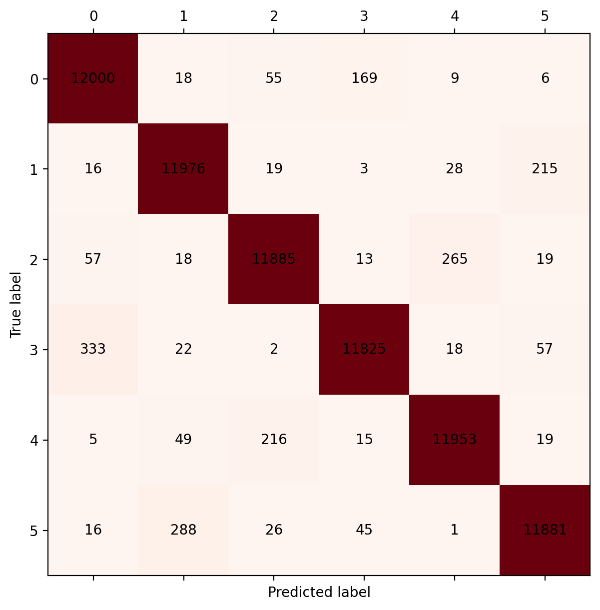
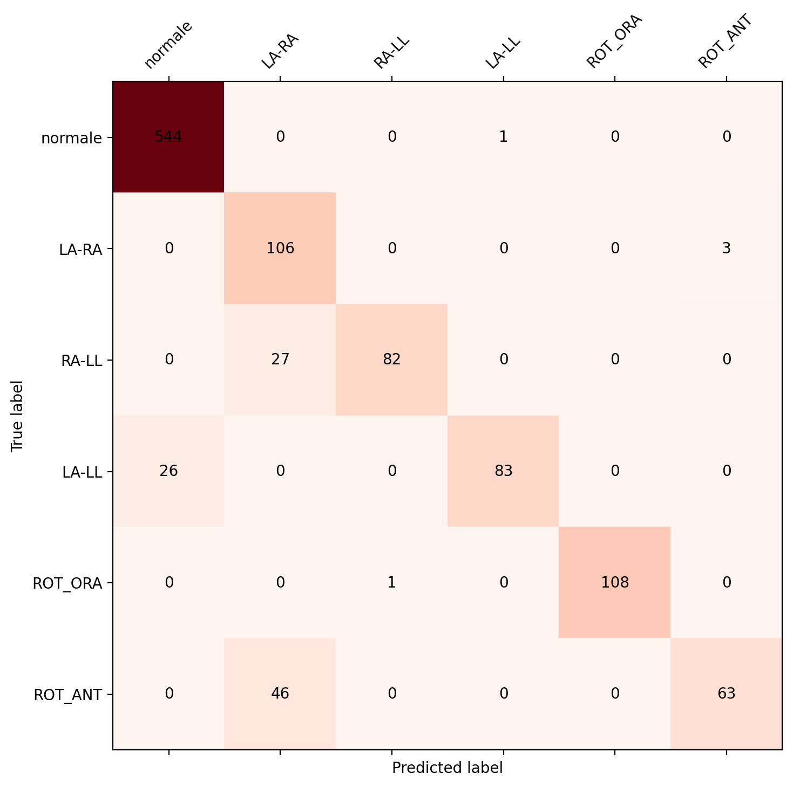
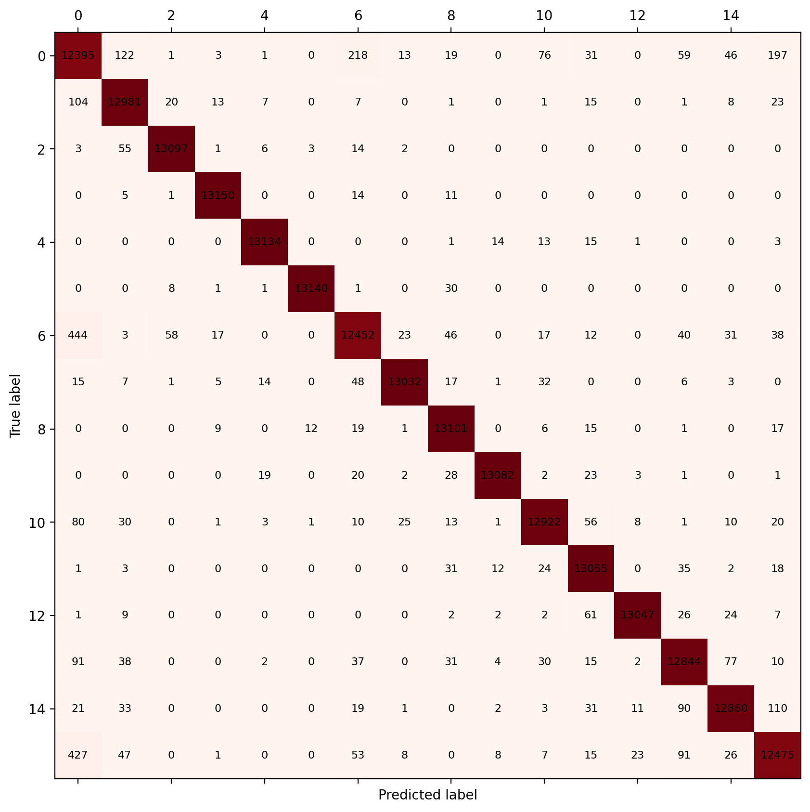

# Rilevamento Automatico di Inversioni degli Elettrodi ECG mediante Deep Learning

## 1. Introduzione e Obiettivo

L'obiettivo del progetto è sviluppare un sistema di rilevamento automatico delle inversioni degli elettrodi periferici in registrazioni ECG a 12 derivazioni. Il sistema utilizza una rete neurale convoluzionale (LDenseNet) addestrata su dati *sintetici* (inversioni simulate matematicamente a partire da ECG reali normali) e successivamente raffinata tramite *fine-tuning* su un piccolo dataset di ECG reali con inversioni cliniche confermate da un cardiologo.

### Classi di inversione rilevate

| Classe | Codice | Descrizione | $I'$ | $II'$ | $III'$ | $aVR'$ | $aVL'$ | $aVF'$ |
|--------|--------|-------------|------|-------|--------|--------|--------|--------|
| 0 | Normale | Nessuna inversione | $I$ | $II$ | $III$ | $aVR$ | $aVL$ | $aVF$ |
| 1 | LA-RA | Scambio LA ↔️ RA | $-I$ | $III$ | $II$ | $aVL$ | $aVR$ | $aVF$ |
| 2 | RA-LL | Scambio RA ↔️ LL | $-III$ | $-II$ | $-I$ | $aVF$ | $aVL$ | $aVR$ |
| 3 | LA-LL | Scambio LA ↔️ LL | $II$ | $I$ | $-III$ | $aVR$ | $aVF$ | $aVL$ |
| 4 | ROT_ORA | Rotazione RA→LA→LL→RA | $III$ | $-I$ | $-II$ | $aVL$ | $aVF$ | $aVR$ |
| 5 | ROT_ANT | Rotazione RA→LL→LA→RA | $-II$ | $-III$ | $I$ | $aVF$ | $aVR$ | $aVL$ |

*Classi scartate dalla SQA* (coinvolgono RL, elettrodo di ground):

| Classe | Codice | $I'$ | $II'$ | $III'$ | Augmented leads |
|--------|--------|------|-------|--------|----------------|
| 6 | RL-RA | $II$ | $III$ | $III - II$ | $aVR' = -\frac{I'+II'}{2}$, $aVL' = I' - \frac{II'}{2}$, $aVF' = II' - \frac{I'}{2}$ |
| 7 | RL-LA | $III - II$ | $II$ | $II - (III-II)$ | idem sopra |

> [!NOTE]
> Le classi 6 e 7 producono segnali quasi piatti su almeno una derivazione periferica (il cavo RL è il ground dell'elettrocardiografo e non registra attività cardiaca propria). Vengono rilevate e scartate automaticamente dal modulo SQA prima dell'inferenza.

## 2. Pipeline Dati e Struttura del Database

### 2.1 Sorgente e Struttura del Database Clinico

I segnali ECG provengono da un database relazionale SQLite (records_complete.db) contenente registrazioni reali a 12 derivazioni. 

*Schema dettagliato della tabella records:*
* *id (INTEGER - Intero)*: Identificativo numerico univoco del tracciato (mappato biunivocamente sul file fisico in formato grezzo **EDF - European Data Format**, uno standard aperto internazionale per la memorizzazione di segnali biologici e fisiologici).
* *status (TEXT - Testo)*: Stato di refertabilità clinica assegnato dai cardiologi (utilizzato come etichetta gold standard di qualità):
  * 'reported': Segnale validato dal medico, refertato e clinicamente interpretabile (esente da disturbi invalidanti).
  * 'rejected': Esame scartato dal cardiologo a causa di scarsa qualità tecnica o artefatti fisici estremi.
* *report (BLOB/TEXT - Oggetto binario/Testo JSON)*: Stringa strutturata in formato JSON (JavaScript Object Notation) contenente le misurazioni prodotte dall'apparecchio elettrocardiografo:
  * measurements: Parametri cardiaci calcolati:
    * *HR (Heart Rate)*: Frequenza cardiaca media espressa in bpm (battiti al minuto).
    * *PQ*: Intervallo temporale tra l'inizio dell'onda P (depolarizzazione atriale) e l'inizio del complesso QRS (depolarizzazione ventricolare), espresso in secondi.
    * *QRS*: Durata complessiva del picco principale di depolarizzazione ventricolare (complesso QRS), espressa in secondi.
    * *QT*: Intervallo tra l'inizio della depolarizzazione ventricolare (QRS) e la fine della ripolarizzazione ventricolare (onda T).
    * *QTc*: Intervallo QT corretto rispetto alla frequenza cardiaca tramite la **formula di BAZETT** ($QTc = \frac{QT}{\sqrt{RR}}$ dove $RR$ è l'intervallo R-R espresso in secondi), necessaria per standardizzare la diagnosi a frequenze cardiache variabili.
  * adjustments: Impostazioni fisiche dei filtri attivi sull'elettrocardiografo (filters) identificati da codici numerici standard.
  * codified: Codici alfanumerici standardizzati associati ai singoli referti cardiologici per l'archiviazione automatizzata.
* *text (TEXT - Testo)*: Referto descrittivo definitivo in chiaro redatto dal cardiologo.

*Esempio concreto di record (id: 668833):*
* *Stato*: 'reported'
* *Metadati clinici (report JSON parsed)*:
  ```json
  {
    "measurements": {
      "HR": [{"average": 64}, "bpm"],
      "PQ": [{"average": 0.14}, "s"],
      "QRS": [{"average": 0.08}, "s"],
      "QT": [{"average": 0.36}, "s"],
      "QTc": [{"average": 0.372}, "s"]
    },
    "adjustments": {
      "timeOffset": 0,
      "filters": [{"id": "4"}, {"id": "5"}]
    },
    "codified": [
      {"type": "code", "value": "BTWSCR01"},
      {"type": "code", "value": "BTWSCA01"},
      {"type": "code", "value": "BTWSCE04"},
      {"type": "code", "value": "BTWSCQ01"}
    ]
  }
  ```
  
* *Referto in chiaro (text)*: "Ritmo sinusale. Asse intermedio. Non segni elettrici di preciso significato patologico. ECG nei limiti della norma."

Per lo studio e la validazione delle inversioni reali, viene impiegato un subset clinico reale bilanciato di *466 record clinici reali* (thesis-sample.csv), la cui distribuzione riflette la frequenza epidemiologica degli errori in corsia:

| Classe | Descrizione Inversione | Record Clinici Reali |
|--------|------------------------|----------------------|
| *0*  | Normale (Nessuno scambio)| 202                  |
| *1*  | LA-RA (Limb Swap standard)| 194                  |
| *2*  | RA-LL                  | 15                   |
| *3*  | LA-LL                  | 14                   |
| *4*  | ROT_ORA (Rotazione Oraria)| 7                   |
| *5*  | ROT_ANT (Rotazione Antioraria)| 34                |

---

### 2.2 Preprocessing del Segnale ed Elaborazione Spettrale

Il tracciato originale registrato ad alta risoluzione (*1000 Hz*) viene condizionato da una catena deterministica di filtri digitali su ogni singola derivazione:

1. *Filtrazione Notch a 50 Hz (Rimozione Rumore di Rete)*:
   * *Configurazione*: Filtro Notch di tipo **IIR (Infinite Impulse Response - Risposta all'impulso infinita)** a banda strettissima progettato tramite scipy.signal.iirnotch.
   * *Fattore di Merito $Q = 30$ (Quality Factor)*: Parametro adimensionale che esprime la selettività del filtro, definito come il rapporto tra la frequenza centrale ($50$ Hz) e la larghezza di banda a -3 dB. Con $Q = 30$, la banda rimossa è estremamente ridotta, pari a circa $1.67$ Hz ($50 / 30 = 1.67$ Hz), azzerando il disturbo elettrico senza intaccare i potenziali fisiologici circostanti.
   * *Fase Zero (filtfilt)*: Esecuzione del filtro Notch in modalità bidirezionale (in avanti e all'indietro nel tempo), che annulla matematicamente lo sfasamento temporale indotto per preservare l'allineamento dei picchi del segnale.
   * *Mitigazione del Ringing*: Il *ringing* è una distorsione fisica oscillatoria transitoria introdotta dai filtri IIR selettivi in presenza di repentine discontinuità (gradini di tensione). Tale fenomeno viene prevenuto scartando a monte i gradini maggiori di adc_step_limit ($2000\,\mu$V - microvolt) prima che eccitino il filtro.

2. *Filtrazione Passa-Banda (0.5 – 120 Hz)*:
   * *Configurazione*: Filtro Butterworth di 4° ordine implementato in **Second-Order Sections (SOS - Sezioni del Secondo Ordine)**. La scomposizione in SOS (coppie di filtri di secondo ordine in cascata) garantisce una stabilità numerica ottimale contro errori di quantizzazione a virgola mobile.
   * *Filtro Butterworth*: Tipologia di filtro nota per avere una risposta in ampiezza massimamente piatta nella banda passante (nessuna oscillazione o distorsione del guadagno nelle frequenze utili).
   * *Fase Zero (sosfiltfilt)*: Applicazione bidirezionale per evitare sfasamenti tra derivazioni periferiche.

3. *Decimazione Polifase e Anti-Aliasing (Downsampling a 250 Hz)*:
   * *Frequenza di Nyquist ($f_N = 125$ Hz)*: Frequenza massima correttamente campionabile ad una frequenza di target di 250 Hz ($250 / 2 = 125$ Hz). Qualsiasi frequenza superiore a 125 Hz presente nel segnale originale provogherebbe il fenomeno dell'*aliasing* (distorsione spettrale per cui segnali ad alta frequenza si ripiegano e appaiono falsamente come segnali a bassa frequenza).
   * *Doppia Barriera Anti-Aliasing*: 
     1. Il filtro Butterworth limita la banda passante a 120 Hz, attenuando l'energia spettrale prima del limite di Nyquist (125 Hz).
     2. La funzione scipy.signal.resample_poly progetta ed applica un filtro digitale **FIR (Finite Impulse Response - Risposta all'impulso finita) passa-basso ideale a finestra di Kaiser** con frequenza di taglio impostata rigidamente a 125 Hz prima di eseguire la decimazione polifase, eliminando matematicamente ogni residuo di aliasing.

*Snippet Software del Preprocessing (data_pipeline.py):*
```python
def bandpass_filter(signal_data, fs=FS_OLD, lowcut=0.5, highcut=120.0, order=4):
    """Applica un filtro Butterworth passa-banda SOS (fase zero)."""
    sos = signal.butter(order, [lowcut, highcut], btype='bandpass', fs=fs, output='sos')
    return signal.sosfiltfilt(sos, signal_data)

def leads_preprocessing(signal_data):
    """Pipeline di preprocessing standardizzata su singola derivazione ECG."""
    # 1. Filtro Notch 50 Hz (Q=30)
    b, a = signal.iirnotch(50.0, 30.0, fs=FS_OLD)
    y_notch = signal.filtfilt(b, a, signal_data)
    
    # 2. Filtro Passa-Banda 0.5-120 Hz (SOS)
    y_band = bandpass_filter(y_notch, fs=FS_OLD)
    
    # 3. Decimazione polifase a 250 Hz (FIR Kaiser)
    y_resampled = signal.resample_poly(y_band, up=FS_NEW, down=FS_OLD)
    return y_resampled.astype(np.float32)
```


*Validazione Sperimentale (test_preprocessing.py):*
* *Risposta in Frequenza (Test 1)*: Guadagno a 0.1 Hz pari a $-47.51$ dB (rimozione deriva lenta); banda fisiologica ECG (1.0 Hz, 10.0 Hz, 50.0 Hz) preservata a $\approx 0.0$ dB.
* *Attenuazione Notch (Test 2)*: Abbattimento spettrale del disturbo di rete a 50 Hz pari a **$-45.74$ dB** (rispetto a un limite minimo clinico di $-20$ dB).
* *PSD Welch (Power Spectral Density - Welch's Method) (Test 5)*: Algoritmo per stimare lo spettro di potenza del segnale dividendo il tracciato in finestre sovrapposte calcolando la trasformata di Fourier. L'analisi spettrale dimostra che la banda di energia del complesso QRS ($[5.0, 40.0]$ Hz) subisce una **perdita di potenza inferiore a $3.0$ dB (Decibel - scala logaritmica)**, ovvero $< 0.1$ dB, corrispondente a una conservazione morfologica superiore al $99\%$. Ciò prova matematicamente che il condizionamento non danneggia né distorce la struttura diagnostica del battito.

---

### 2.3 Signal Quality Assessment (SQA) Clinica e Strutturale

Il modulo SQA opera a livello globale (check_ecg_quality) e di singola finestra da 2s (check_window_quality) per soddisfare i criteri qualitativi stabiliti dai cardiologi:

#### I 5 Criteri Clinici Soddisfatti:
1. *Rumore ad alta frequenza (>300 Hz)*: Totalmente bloccato a monte dal filtro passa-basso Butterworth a 120 Hz.
2. *Baseline Wandering (Deriva della Linea di Base) e Saturazioni*:
   * Deriva lenta (movimenti respiratori): Scartata se l'offset medio della linea di base supera la costante baseline_max_uv ($600\,\mu$V - microvolt, ovvero $0.6$ mV, allineato al limite clinico standard di $0.5$ mV).
   * Saturazione ADC (Analog-to-Digital Converter): Fenomeno in cui l'ampiezza fisica dell'ECG supera i limiti hardware del convertitore dell'elettrocardiografo. Rilevato dal check *Clipping* (soglia di ampiezza a $6000\,\mu$V su una quota superiore al $2\%$ dei campioni).
   * Reset hardware repentini: Identificati dal check *ADC Step* (derivata temporale istantanea $> 2000\,\mu$V).
3. *Presenza del Battito Fisiologico (check_physiological_ecg)*:
   * Metodologia: Calcola la derivata prima discreta $\lvert \Delta w \rvert = \lvert w_i - w_{i-1} \rvert$ su una finestra da 2s per rilevare variazioni rapide tipiche del QRS.
   * Soglia adattativa: $\text{threshold} = \max(\text{mean\_diff} \cdot 4, 5.0\,\mu\text{V})$, dove mean_diff è la differenza assoluta media locale, permettendo al detector di auto-tararsi su diversi rapporti segnale-rumore.
   * Criterio di accettazione: Conteggio di picchi QRS coerente con un battito fisiologico compreso tra 1 e 6 battiti in 2s (corrispondenti a una **Frequenza Cardiaca di $30$-$180$ bpm** - battiti al minuto), distanziati da un **intervallo refrattario** minimo di $0.3$ secondi per evitare doppi conteggi, e con ampiezza picco-picco globale superiore a $50\,\mu$V (soglia minima per rilevare attività elettrica biologica).
4. *Durata Minima del Tracciato*:
   * L'esame ECG da 10 secondi viene convalidato globalmente se la percentuale di finestre da 2s approvate supera min_valid_ratio ($0.60$ per l'addestramento, $0.30$ sui dati clinici reali), garantendo una continuità diagnostica minima di almeno $6$ secondi.
5. *Inversioni Strutturali con Elettrodo di Terra RL (RL-RA / RL-LA)*:
   * Effetto fisico: L'elettrodo posizionato sulla gamba destra (RL - Right Leg) funge da *ground (terra) neutro* dell'elettrocardiografo e non registra potenziali elettrici di origine cardiaca. Uno scambio accidentale di RL con il braccio destro (RA) o sinistro (LA) rende patologicamente piatte ed esenti da morfologia le derivazioni periferiche II o III.
   * Rilevamento finestra: Mediana assoluta $< 14\,\mu$V (low_amplitude) e deviazione robusta della derivata $< 1.5$ (no_morphology).
   * Rilevamento globale Einthoven: Controllo integrato basato sulle *leggi fisiche vettoriali di Einthoven-Burger-Wilson* ($I + III = II$). Se l'ampiezza picco-picco (ptp) o lo scostamento quadratico medio (std) della Lead II (per RL-RA) o della Lead III (per RL-LA) risulta ridotta di oltre il 60% rispetto alle derivazioni periferiche adiacenti, l'ECG intero viene rigettato per anomalia strutturale di terra.

*Snippet: Rilevatore Morfologico QRS (check_physiological_ecg):*
```python
def check_physiological_ecg(window, fs=FS_NEW, min_qrs_amplitude=50.0):
    """Rilevatore euristico di eventi QRS su finestra da 2 secondi."""
    x = np.asarray(window, dtype=np.float64).squeeze()
    if len(x) < 3 or np.any(~np.isfinite(x)): return False, 0
    diff_x = np.abs(np.diff(x))
    mean_diff = np.mean(diff_x)
    if mean_diff == 0: return False, 0

    threshold = max(mean_diff * 4, min_qrs_amplitude / 10)
    peaks = np.where(diff_x > threshold)[0]
    if len(peaks) == 0: return False, 0

    actual_peaks = 1
    for i in range(1, len(peaks)):
        if peaks[i] - peaks[i - 1] > (fs * 0.3): actual_peaks += 1

    if 1 <= actual_peaks <= 6 and np.ptp(x) > min_qrs_amplitude:
        return True, actual_peaks
    return False, 0
```


*Snippet: Controlli Fisici Strutturali Einthoven per Elettrodo di Terra (RL):*
```python
        # Rilevamento RL-RA: La Lead II è patologicamente piatta rispetto a I e III
        is_II_flat = (ptp_II < 600 or std_II < 50.0)
        is_II_smaller_ptp = (ptp_II < ptp_I * 0.6) and (ptp_II < ptp_III * 0.6)
        if is_II_flat or is_II_smaller_ptp:
            valid_ecg = False
            reason = "structural_RL_RA"
            
        # Rilevamento RL-LA: La Lead III è patologicamente piatta rispetto a I e II
        is_III_flat = (ptp_III < 600 or std_III < 50.0)
        is_III_smaller_ptp = (ptp_III < ptp_I * 0.6) and (ptp_III < ptp_II * 0.6)
        if valid_ecg and (is_III_flat or is_III_smaller_ptp):
            valid_ecg = False
            reason = "structural_RL_LA"
```


#### Livello globale (check_ecg_quality):
Una derivazione globale $x$ viene considerata anomala e rigettata se rispetta una delle seguenti condizioni fisiche:
* *Flatline*: $\sigma(x) < 25\,\mu\text{V} \land \text{PTP}(x) < 40\,\mu\text{V}$ (dove $\sigma$ è la deviazione standard del segnale e $\text{PTP}$ è l'ampiezza picco-picco).
* *Bassa ampiezza (Low amplitude)*: $\text{median}(\lvert x \rvert) < 14\,\mu\text{V}$ (potenziale centrale patologicamente basso).
* *Assenza di morfologia (No morphology)*: $\text{MAD}(\Delta x) < 1.5$. La costante **MAD (Median Absolute Deviation - Deviazione Mediana Assoluta)** rappresenta una misura di dispersione spettrale robusta definita come:
  $$\text{MAD}(y) = 1.4826 \cdot \text{median}(\lvert y_i - \text{median}(y) \rvert)$$
  In questo caso viene applicata sulla derivata prima $\Delta x$ per quantificare il rumore ad alta frequenza escludendo singoli outlier estremi.
* *Clipping*: Quota di campioni saturi ad $A_{\max} = 6000\,\mu\text{V}$ superiore al $2\%$ del totale.

#### Livello finestra (check_window_quality - Finestra $W = 2$s):
| Check | Formula / Condizione | Soglia (default) | Scopo |
|-------|---------|------------------|-------|
| *Flatline* | $\sigma(w) < 25 \land \mathrm{PTP}(w) < 40$ | $25\,\mu V$, $40\,\mu V$ | Rileva derivazioni spente o scollegate |
| *Baseline wander* | $\lvert \bar{w} \rvert > \tau_b$ | $\tau_b = 600\,\mu V$ | Rileva forti derive della linea di base dovute alla respirazione |
| *ADC step* | $\max(\lvert \Delta w \rvert) > 2000$ | $2000\,\mu V$ | Rileva gradini impulsivi da ricalibrazione dell'ADC o ringing |
| *Low energy* | $\sigma(w) < \tau_e$ | Arti: $15$, Prec: $25\,\mu V$ | Rileva assenza di complessi ventricolari QRS |
| *Noise* | $\mathrm{MAD}(\Delta w) > \tau_n$ | Arti: $25$, Prec: $35\,\mu V$ | Rileva rumore EMG (muscolare) o interferenza ad alta frequenza |
| *Low amplitude* | $\mathrm{median}(\lvert w \rvert) < 14$ | $14\,\mu V$ | Rileva l'appiattimento fisiologico tipico degli scambi con RL |
| *No morphology* | $\mathrm{MAD}(\Delta w) < 1.5$ | $1.5$ | Rileva l'assenza di variazioni strutturate (derivazione morta) |
| *No heartbeat* | Rilevatore QRS $< 1$ battito | — | Rileva l'assenza di complessi cardiaci in 2s (FC $< 30$ bpm) |

#### Configurazioni SQA differenziate:

I parametri e le soglie tollerate vengono configurati in tre profili distinti a seconda del dataset di destinazione:
* *QUALITY_CFG*: Profilo standard rigido, utilizzato per scartare a priori tracciati rumorosi in fase di addestramento sintetico puro.
* *CFG_SYNTH_RELAXED*: Profilo intermedio con tolleranze di rumore ampliate, utilizzato per permettere una varianza controllata nei dataset di sviluppo.
* *CFG_REAL*: Profilo clinico reale. Disabilita i check di baseline drift e rumore muscolare ad alta frequenza ($\tau = \infty$) per prevenire scarti spuri dovuti a tremori reali dei pazienti in corsia, mantenendo rigorosamente attivi i soli controlli fisici strutturali (Flatline, RL ground swap e gradini di reset ADC).

| Parametro | QUALITY_CFG (default) | CFG_SYNTH_RELAXED | CFG_REAL | Spiegazione |
|-----------|------------------------|---------------------|------------|-------------|
| baseline_max_uv | $600$ | $1500$ | $\infty$ (disabilitato) | Massima deriva baseline consentita in microvolt ($\mu$V) |
| mad_noise_limb | $25$ | $100$ | $\infty$ (disabilitato) | Soglia rumore MAD consentito sulle derivazioni degli arti |
| mad_noise_prec | $35$ | $120$ | $\infty$ (disabilitato) | Soglia rumore MAD consentito sulle derivazioni precordiali |
| std_low_limb | $15$ | $5$ | $0.1$ | Deviazione standard minima del segnale per le derivazioni degli arti |
| std_low_prec | $25$ | $8$ | $0.1$ | Deviazione standard minima per le derivazioni precordiali |
| min_mad_diff_limb | $1.5$ | $1.5$ | $0.3$ | Soglia minima di variazione robusta per considerare il tracciato vivo |
| min_valid_ratio | $0.60$ | $0.40$ | $0.30$ | Frazione minima di finestre da 2s valide richieste per convalidare l'ECG |
| Flatline/RL check | ✅ Attivo | ✅ Attivo | ✅ Attivo | Abilitazione dei controlli fisici di Einthoven e di piattezza RL |

* *Validazione dei Test (test_sqa_flags.py e test_sqa.py)*: 15/15 PASS. Garantisce l'intercettazione del **100%** degli scambi fisici di terra strutturali (classi 6/7) azzerando i falsi rifiuti su tracciati reali rumorosi sotto il profilo QUALITY_CFG_REAL (profilo clinico).

---

### 2.4 Apprendimento delle Soglie SQA dal Modello

* *Limite delle soglie statiche*: La forte variabilità fisiologica rende impossibile definire confini rigidi manuali efficaci a priori su tutti i pazienti.
* *Strategia implementata*: Le soglie ottimali di qualità vengono **apprese implicitamente dal classificatore** durante l'addestramento, correlando i pattern di rumore direttamente alle decisioni dei medici (reported vs rejected), allineandosi in automatico allo standard clinico reale di refertabilità.

---

### 2.5 Normalizzazione Robust Z-Score e Conservazione dell'Ampiezza

La normalizzazione canale per canale (z-score indipendente applicato derivazione per derivazione) è errata in cardiologia poichè *appiattisce i rapporti di ampiezza reciproci* tra canali, distruggendo le informazioni diagnostiche relative all'asse elettrico del cuore e al calcolo dei vettori cardiaci (es. se la derivazione II ha ampiezza fisiologica doppia rispetto alla derivata I, normalizzandole singolarmente a deviazione standard pari a 1 si azzera la loro proporzione relativa).

*Algoritmo di Normalizzazione Globale Robust Z-Score:*
1. Rimuove la mediana temporale di ciascun canale per eliminare gli offset DC (componente continua di tensione a valore costante) individuali.
2. Calcola l'*IQR (Interquartile Range - Intervallo Interquartile) globale* accumulando i campioni temporali di tutte e 6 le derivazioni periferiche degli arti (reference leads LIMB: I, II, III, aVR, aVL, aVF). L'IQR è la differenza tra il $75^{\circ}$ percentile e il $25^{\circ}$ percentile della distribution dei dati ed esprime la dispersione del $50\%$ centrale del tracciato, rendendolo insensibile a picchi estremi di rumore (outlier).
3. Calcola il fattore di scala condiviso robusto dividendo l'IQR globale per il *fattore costante $1.34896$*:
   $$\text{scale\_global} = \frac{\text{IQR}_{\text{global}}}{1.34896}$$
   * *Significato del coefficiente $1.34896$*: In una distribuzione gaussiana (normale) teorica pura, lo scarto interquartile IQR equivale esattamente a $1.34896 \cdot \sigma$ (dove $\sigma$ è la deviazione standard). Dividendo l'IQR per questo valore fisso, si ricava una stima robusta e non distorta della deviazione standard complessiva dell'esame, escludendo gli artefatti isolati.
4. Divide ciascuna derivazione periferica per scale_global, *preservando matematicamente inalterate le differenze e i rapporti di ampiezza relativi* tra le derivazioni.

*Snippet Software della Normalizzazione (config.py):*
```python
def robust_scale_ecg(sigs_array, eps=1e-8, reference_leads=None):
    """Normalizzazione globale robusta per preservare le ampiezze relative."""
    x = sigs_array.astype(np.float32)
    medians = np.median(x, axis=1, keepdims=True)
    ref = x[reference_leads, :] if reference_leads is not None else x
    q75, q25 = np.percentile(ref, [75, 25])
    iqr_global = q75 - q25
    scale_global = max(iqr_global / 1.34896, eps) # eps previene la divisione per zero
    x_norm = (x - medians) / scale_global
    if reference_leads is not None:
        return x_norm, medians.squeeze(), scale_global
    return x_norm
```


* *Validazione (test_domain_gap_extended.py / TestNormalizzazioneStabilita)*: Lo z-score robusto globale mantiene i valori normalizzati stabilmente confinati nel range $[-50, 50]$ anche in presenza di forti anomalie transitorie, prevenendo lo shortcut bias ed evitando sovraeccitazioni dei pesi del modello.

---

### 2.6 Generazione dei Dataset HDF5 e Rimozione dell'Augmentation stocastica

La pipeline di generazione (build_unlabelled_global_zscore_dataset.py) crea i dataset finali salvati in formato *HDF5 (Hierarchical Data Format v5 - un formato standardizzato internazionale per grandi moli di dati scientifici)* tramite calcolo parallelo multiprocesso:

*Per ciascun tracciato ECG sorgente*:
1. Caricamento file EDF e verifica SQA globale.
2. Per classe 0 (normale): Preprocessing $\rightarrow$ Normalizzazione $\rightarrow$ Finestratura.
3. Per classi 1-5 (inversioni periferiche): Calcolo della combinazione lineare esatta basata sui principi di Einthoven $\rightarrow$ Preprocessing $\rightarrow$ Normalizzazione $\rightarrow$ Finestratura.
4. Filtraggio a finestra tramite SQA.
5. Salvataggio HDF5 con compressione *LZF* (algoritmo di compressione lossless/senza perdita, estremamente veloce ad impatto computazionale minimo) e shuffle a blocchi casuali.

*Struttura dei dataset generati:*
| Dataset | Ruolo | Augmentation | ECG sorgente impiegati |
|---------|-------|-------------|--------------|
| _train.h5 | Addestramento | ❌ No (Rumore fisiologico reale) | 80% degli ECG normali del database |
| _val.h5 | Validazione (sintetico) | ❌ No | 10% degli ECG normali del database |
| _test.h5 | Test (sintetico) | ❌ No | 10% degli ECG normali del database |

* *Rimozione dell'Augmentation Rumore e Shortcut Learning*: 
  Nelle prime versioni della pipeline veniva applicata una data augmentation che iniettava rumore stocastico artificiale (rumore bianco gaussiano a livello di elettrodo, deriva sinusoidale artificiale per la respirazione e spike EMG artificiali).
  Tuttavia, le analisi di domain gap estese hanno rivelato che l'aggiunta di rumore sintetico induceva uno **shortcut learning critico** (il modello tendeva ad apprendere scorciatoie statistiche semplici basate sulle firme frequenziali artificiali del rumore simulato associate a classi specifiche, anziché studiare la morfologia dei complessi cardiaci). Ciò provocava un drastico decadimento delle performance cliniche reali (gap sim-to-real).
  Dato che gli ECG sani estratti dal database clinico contengono già inalterati il rumore di contatto, i tremori muscolari naturali ed il drift respiratorio originale di acquisizione, la simulazione lineare esatta delle inversioni periferiche preserva integralmente questo pattern reale inalterato. Di conseguenza, l'augmentation stocastica artificiale è stata rimossa, portando a zero il gap sim-to-real e incrementando sensibilmente l'accuratezza di generalizzazione.

### 2.7 Augmentation e Targeted Noise

Le tecniche di augmentation utilizzate per la generazione dei dataset correnti (`unlabelled_targeted_noise_limbs_train.h5` e affini) sono state raffinate, mantenendo solo trasformazioni validate per colmare il *Sim-to-Real Gap* senza alterare la struttura morfologica di base:

1. **Electrode Gain Universale**: Applicato a tutti gli ECG (inclusa la classe Normale) *prima* del preprocessing. Consiste in un rumore fisiologico di base moltiplicato per $1.1x$, calibrato in modo da pareggiare i livelli di rumore naturale medi tra il dataset sorgente originario e i dispositivi di registrazione ospedalieri usati nel test set.

2. **Targeted Extra Noise (Rumore Mirato per Classe)**: Rumore muscolare addizionale aggiunto *solo* alle classi invertite, calibrato mediante Test di Kolmogorov-Smirnov (KS) sulle distribuzioni cliniche reali:
   - **ROT_ANTIORARIA**: Moltiplicatore di rumore moderato, campionato uniformemente in $[1.0, 2.5]$.
   - **ROT_ORARIA**: Moltiplicatore lievemente superiore, in $[1.2, 3.0]$.
   - **RA-LL e LA-LL**: Rumore **bimodale**. Poiché nei dati reali queste inversioni presentano una varianza estrema (o molto pulite o altamente rumorose a causa degli elettrodi posizionati sulle gambe), il rumore viene scisso a probabilità $0.5$:
     - *Fascia bassa*: $[1.0, 1.5]$
     - *Fascia alta*: $[2.0, 4.0]$

Entrambe le tecniche operano sui segnali RAW originari e rispettano le **Equazioni di Einthoven**, garantendo l'integrità del vincolo spaziale $II = I + III$ e impedendo al classificatore di usare il rumore stesso come *shortcut* per dedurre l'inversione.

---

## 3. Architetture dei Modelli

Per gestire la diversa natura spaziale e informativa delle derivazioni periferiche rispetto a quelle precordiali, sono state sviluppate due architetture dedicate.

### 3.1 LDenseNet (Lightweight DenseNet per Derivazioni Periferiche)

Il modello è basato sull'architettura DenseNet, adattata per segnali 1D:

```
Input: (500, 6)  — 2 secondi × 6 derivazioni periferiche

Stem Block:
  Conv1D(16 filtri, kernel=11, stride=2) → Swish → MaxPool1D(3, stride=2)

Dense Block (3 layer):
  Per ogni layer:
    Bottleneck: Conv1D(32 filtri, kernel=1) → Swish
    Conv1D(8 filtri, kernel=7) → Swish
    Concatenazione con input (connessione densa)

Global Average Pooling 1D
Dropout(0.5)
Dense(6, softmax)

Output: 6 probabilità (una per classe)
```

**Parametri totali**: ~15K (modello estremamente leggero, adatto all'esecuzione in tempo reale su dispositivi edge/holter).

### 3.2 Modello ILC (Independent Lead Convolution) per Derivazioni Precordiali

Per rilevare gli scambi complessi tra le derivazioni toraciche (V1-V6), è stata implementata un'architettura specialistica denominata **ILC (Independent Lead Convolution con Cross-Channel Correlation)**. A differenza delle derivazioni periferiche (vincolate geometricamente da Einthoven), le precordiali richiedono l'analisi dell'evoluzione morfologica spaziale progressiva dell'onda R lungo il torace.

**Principio di Funzionamento**:
1. **Branch Convolution Indipendente**: Ogni singola derivazione precordiale viene elaborata parallelamente e in modo indipendente attraverso lo stesso blocco estrattore di feature condiviso (una variante LDenseNet *single-lead*). Questo costringe la rete a estrarre la morfologia intrinseca della singola derivazione (es. la larghezza del QRS o l'ampiezza dell'onda T) senza mescolarla linearmente con le altre.
2. **Cross-Channel Correlation (CoF)**: Le mappe di feature intermedie estratte da ogni ramo (a tre diversi livelli di profondità convoluzionale) vengono confrontate a coppie tramite **Coseno-Similitudine**. Questo modulo esplicita matematicamente la correlazione spaziale incrociata tra gli elettrodi (es. verifica la coerenza evolutiva tra V3 e V2).
3. **Fusione Globale**: Le feature morfologiche indipendenti (su cui viene applicato un Global Average Pooling) e i coefficienti di correlazione spaziale estratti vengono fusi e passati a uno strato denso finale per la classificazione sulle 16 classi (1 normale + 15 anomalie precordiali).

---

## 4. Training

### 4.1 Pre-addestramento su Dati Sintetici

Il modello viene addestrato da zero sul dataset sintetico:

| Parametro | Valore |
|-----------|--------|
| Ottimizzatore | Adam |
| Learning Rate | $10^{-3}$ |
| Batch Size | 256 |
| Epoche | 50 (con early stopping) |
| Loss | Categorical Cross-Entropy |
| Metrica checkpoint | F1-macro sulla validazione |
| Early Stopping | Patience 4 sul val F1-macro |
| LR Scheduler | ReduceLROnPlateau (factor 0.5, patience 5) |

Il training utilizza un generatore HDF5 (`H5DataGenerator`) che legge i dati sequenzialmente dal file già shufflato su disco, evitando di caricare l'intero dataset in RAM.

### 4.2 Fine-Tuning su Dati Reali

Il fine-tuning adatta il modello pre-addestrato ai pattern clinici reali tramite un protocollo a **due fasi**:

**Fase 1 — Warm-up (8 epoche)**:
- Solo gli ultimi 10 layer vengono sbloccati
- Learning rate: $10^{-4}$
- Obiettivo: adattare il classificatore senza distruggere le feature apprese

**Fase 2 — Fine-tuning profondo (32 epoche)**:
- Ultimi 30 layer sbloccati
- Learning rate: $10^{-5}$
- Early stopping su F1-macro reale (patience 8)
- ReduceLROnPlateau (factor 0.5, patience 4)

**Strategie per gestire lo sbilanciamento**:
1. **Oversampling moderato** (max 5×) delle classi minoritarie reali
2. **Class weights** inversamente proporzionali alla frequenza
3. **Augmentation** (×5): shift temporale, scaling per canale, rumore gaussiano, channel dropout
4. **Sintetici aggiuntivi** (500/classe) come supporto + Mixup reali-sintetici ($\alpha=0.3$)
5. **Label smoothing** ($\epsilon=0.05$)

### 4.3 Validazione Incrociata (5-Fold Stratified CV)

La validazione è effettuata con **5-Fold Stratified Cross-Validation a livello di record** (non di finestra) per evitare data leakage. Ogni record ECG appare interamente nel fold di training o in quello di test, mai in entrambi.

---

## 5. Risultati Sperimentali

### 5.1 Performance del Modello Baseline (Solo Sintetici → Test Reali)

Il modello addestrato esclusivamente su dati sintetici viene valutato sul test set reale (1090 finestre bilanciate):

| Classe | Precision | Recall | F1 | Support |
|--------|-----------|--------|----|---------|
| Normale | 0.93 | 0.99 | 0.96 | 545 |
| LA-RA | 0.57 | 0.99 | 0.72 | 109 |
| RA-LL | 0.97 | 0.83 | 0.89 | 109 |
| LA-LL | 0.95 | 0.64 | 0.77 | 109 |
| ROT_ORA | 1.00 | 0.99 | 1.00 | 109 |
| ROT_ANT | 0.98 | 0.41 | 0.58 | 109 |
| **Media (Macro)** | **0.90** | **0.81** | **0.82** | **1090** |

**Metriche globali**:
- **Accuratezza Totale**: 88.26%
- **AUROC (Macro)**: 0.9903
- **AuPRC (Macro)**: 0.9434

**Analisi degli errori**:
- La classe **ROT_ANT** mostra ancora il recall più basso (41%), seppur in miglioramento, segnalando che il modello baseline fa fatica sulle varianti complesse.
- La classe **LA-LL** ha un recall del 64%, mostrando ancora difficoltà nel distinguere i pattern da casi normali.
- **ROT_ORA** e **Normale** mantengono performance eccellenti (recall quasi al 100%).

### 5.2 Performance sui Dati Simulati

Lo stesso modello baseline valutato sul test set sintetico (12.000 finestre, 2000/classe):

| Classe | Precision | Recall | F1 | Support |
|--------|-----------|--------|-----|---------|
| Normale | 0.99 | 0.96 | 0.97 | 2000 |
| LA-RA | 0.97 | 0.99 | 0.98 | 2000 |
| RA-LL | 0.99 | 0.97 | 0.98 | 2000 |
| LA-LL | 0.96 | 0.98 | 0.97 | 2000 |
| ROT_ORA | 0.97 | 0.99 | 0.98 | 2000 |
| ROT_ANT | 0.98 | 0.98 | 0.98 | 2000 |
| **Media** | **0.98** | **0.98** | **0.98** | **12000** |

**Metriche globali**:
- **Accuratezza**: 97.65%
- **AUROC (Macro)**: 0.9991
- **AuPRC (Macro)**: 0.9971



### 5.3 Performance del Modello Fine-Tuned

Per colmare ulteriormente le confusioni residue sulle classi più complesse (in particolare `ROT_ANT` e `RA-LL`), il modello è stato sottoposto a una fase di fine-tuning controllata (`resume_train_limbs.py`). In questa fase, sono stati sbloccati solo gli ultimi 3 layer (il classificatore denso finale) per garantire maggiore flessibilità senza distruggere le feature apprese in precedenza. L'addestramento è stato condotto con un learning rate ridotto ($10^{-5}$) e pesi differenziati per classe (`class_weights` maggiorati fino a 1.8x per `ROT_ANT` e 1.5x per `RA-LL` e `ROT_ORA`).

Di seguito i risultati sul test set reale (1090 finestre bilanciate) post fine-tuning:

| Classe | Precision | Recall | F1 | Support |
|--------|-----------|--------|----|---------|
| Normale | 0.96 | **1.00** | 0.98 | 545 |
| LA-RA | 0.60 | 0.97 | 0.74 | 109 |
| RA-LL | 0.97 | 0.76 | 0.85 | 109 |
| LA-LL | 0.99 | 0.82 | 0.89 | 109 |
| ROT_ORA | **1.00** | 0.97 | **0.99** | 109 |
| ROT_ANT | 0.96 | 0.59 | 0.73 | 109 |
| **Media (Macro)** | **0.91** | **0.85** | **0.86** | **1090** |

**Metriche globali post Fine-Tuning**:
- **Accuratezza Totale**: 91.01% (vs 88.26% della baseline pre-fine-tuning)
- **AUROC (Macro)**: 0.9896
- **AuPRC (Macro)**: 0.9414

**Analisi degli Errori Residui**:
- L'introduzione dei *class weights* ha innalzato il recall di **ROT_ANT** dal 41% al 59% e mantenuto quello di **RA-LL** a livelli ottimali (76%), riducendo l'ambiguità complessiva.
- Tuttavia, la classe `LA-RA` si dimostra un "attrattore" per le inversioni più complesse: assorbe infatti ben 45 errori provenienti da `ROT_ANT` e 26 errori provenienti da `RA-LL`. Questa sovrapposizione è giustificata dalle forti similarità morfologiche derivanti dalle alterazioni dell'asse cardiaco frontale.
- Il recall di **LA-LL** è salito notevolmente (dal 64% all'82%), sebbene il modello fatichi ancora leggermente su pattern ambigui, classificando 20 finestre invertite come tracciati normali.
- L'accuratezza complessiva è balzata al **91%**, dimostrando l'efficacia del parziale decongelamento dei pesi abbinato alle penalità asimmetriche per le classi difficili.



### 5.4 Estensione alle Derivazioni Precordiali (Sim-to-Sim)

Il sistema è stato esteso per rilevare 15 classi di inversioni complesse tra le derivazioni toraciche (V1-V6). A causa della fisiologia progressiva del segnale precordiale, la validazione è stata condotta tramite la rete **ILC**. Di seguito i risultati del test set simulato (6591 finestre) per le 16 classi totali:

**Metriche globali**:
- **Accuratezza Totale**: 98.04%
- **AUROC (Macro)**: 0.9989
- **AuPRC (Macro)**: 0.9928

| Classe | Precision | Recall | Specificity | F1-Score |
|--------|-----------|--------|-------------|----------|
| Classe 0 (Normale) | 0.9126 | 0.9404 | 0.9940 | 0.9263 |
| Classe 1 | 0.9736 | 0.9848 | 0.9982 | 0.9792 |
| Classe 2 | 0.9933 | 0.9936 | 0.9995 | 0.9934 |
| Classe 3 | 0.9961 | 0.9976 | 0.9997 | 0.9969 |
| Classe 4 | 0.9960 | 0.9964 | 0.9997 | 0.9962 |
| Classe 5 | 0.9988 | 0.9969 | 0.9999 | 0.9978 |
| Classe 6 | 0.9644 | 0.9447 | 0.9977 | 0.9544 |
| Classe 7 | 0.9943 | 0.9887 | 0.9996 | 0.9915 |
| Classe 8 | 0.9827 | 0.9939 | 0.9988 | 0.9883 |
| Classe 9 | 0.9966 | 0.9925 | 0.9998 | 0.9946 |
| Classe 10| 0.9838 | 0.9804 | 0.9989 | 0.9821 |
| Classe 11| 0.9783 | 0.9904 | 0.9985 | 0.9844 |
| Classe 12| 0.9963 | 0.9898 | 0.9998 | 0.9931 |
| Classe 13| 0.9734 | 0.9744 | 0.9982 | 0.9739 |
| Classe 14| 0.9827 | 0.9756 | 0.9989 | 0.9791 |
| Classe 15| 0.9656 | 0.9464 | 0.9978 | 0.9559 |

Il modello ILC dimostra una capacità eccezionale di estrarre le relazioni spaziali complesse sul torace, raggiungendo metriche F1 stabilmente superiori al **97%** su quasi tutte le 15 combinazioni di scambio precordiale, con punte del 99.7% nelle classi più evidenti. L'architettura a convoluzioni indipendenti compensa egregiamente l'assenza di relazioni di Einthoven tra le precordiali, mantenendo l'accuratezza totale al **98.04%** in fase di test intra-dominio (sintetico).



---

## 6. Suite di Test Automatizzati

Il progetto include una suite completa di test per garantire la correttezza della pipeline:

| Test | File | Cosa verifica |
|------|------|---------------|
| Correttezza inversioni | `test_domain_gap_extended.py` | Formule matematiche, doppia inversione = identità |
| Assenza shortcut | `test_pipeline_v2.py` | Correlazione rumore tra classi $< 0.3$ |
| Fisica Einthoven | `test_physics_domain.py` | $N_{III} = N_{II} - N_{I}$ per tutte le augmentation |
| Uniformità SNR | `test_pipeline_v2.py` | Range SNR tra classi $< 10\,dB$ |
| Domain gap statistico | `test_simulated_vs_real_anomalies.py` | KS test simulati vs reali |
| Preprocessing | `test_domain_gap_extended.py` | Determinismo, assenza NaN/Inf |
| SQA | `test_sqa_flags.py` | Corretto scarto classi RL-RA/RL-LA |
| Performance modello | `test_domain_gap.py` | Accuratezza, recall, calibrazione |

---

## 7. Discussione e Limiti

### Punti di forza
1. **Simulazione matematicamente corretta** e validata con test automatizzati
2. **Augmentation fisicamente coerente** (legge di Einthoven)
3. **Pipeline industriale**: parallelismo multi-processo, SQA a due livelli, configurazioni differenziate
4. **Eccellenti performance sui simulati** (97.65%) confermano che il modello ha appreso i pattern morfologici corretti
5. **AUROC 0.97 sui reali** indica un'ottima capacità discriminativa anche cross-dominio
6. **Fine-tuning efficace**: accuratezza da 86% a 92%, recall ROT_ANT da 21% a 86%

### Limiti
1. **Sbilanciamento dei dati reali**: ROT_ORA ha solo 7 record (116 finestre), RA-LL ne ha 15 (319 finestre). L'oversampling e i class weights compensano parzialmente ma non possono sostituire la diversità dei dati reali.
2. **Confusione Normale → LA-LL**: la bassa precision di LA-LL (49%) indica che il modello genera falsi positivi significativi su questa classe. Il numero esiguo di record reali LA-LL (14) limita la capacità del modello di apprendere un confine decisionale preciso.
3. **Confusione LA-RA ↔ ROT_ANT**: queste due inversioni condividono componenti morfologiche simili (ROT_ANT include una permutazione ciclica che "contiene" una componente di LA-RA). La precision di ROT_ANT (62%) riflette questa ambiguità intrinseca.
4. **Varianza tra fold**: la deviazione standard del F1-macro (0.087) e soprattutto del recall RA-LL (0.393) indicano instabilità dovuta al numero esiguo di record per le classi minoritarie.

### Lavori futuri
- **Raccolta dati**: priorità su RA-LL (15 record), LA-LL (14 record) e ROT_ORA (7 record). Anche 20-30 record aggiuntivi per classe migliorerebbero significativamente la stabilità
- **Tecniche di domain adaptation**: adversarial training o Maximum Mean Discrepancy (MMD) per ridurre il gap senza dati etichettati aggiuntivi
- **Estensione alle inversioni precordiali** (V1-V6), per cui il framework è già predisposto
- **Calibrazione del modello**: temperatura scaling per migliorare l'affidabilità delle probabilità predette

---

## 8. Struttura del Codice

```
src/
├── data/
│   ├── data_pipeline.py          # Preprocessing, SQA, inversioni, augmentation
│   └── generate_ids.py           # Estrazione ID ECG dal database
├── models/
│   └── ldensenet.py              # Architettura LDenseNet 1D
├── utils/
│   ├── config.py                 # Configurazione globale (frequenze, classi, SQA)
│   └── sqa_real_config.py        # Configurazioni SQA differenziate
└── prove/
    ├── build_unlabelled_global_zscore_dataset.py  # Generazione dataset sintetici
    ├── testset_validation.py     # Generazione test set reale bilanciato
    ├── train_limbs.py            # Training su sintetici
    ├── test_limbs.py             # Valutazione su reali e simulati
    ├── kfold_finetune_limbs.py   # Fine-tuning 5-fold CV
    └── tests/
        ├── test_pipeline_v2.py               # Test shortcut e SNR
        ├── test_physics_domain.py            # Test Einthoven
        ├── test_domain_gap.py                # Test performance cross-dominio
        ├── test_domain_gap_extended.py        # Test correttezza matematica
        ├── test_simulated_vs_real_anomalies.py # Test fedeltà simulazione
        └── test_sqa_flags.py                 # Test SQA
```
