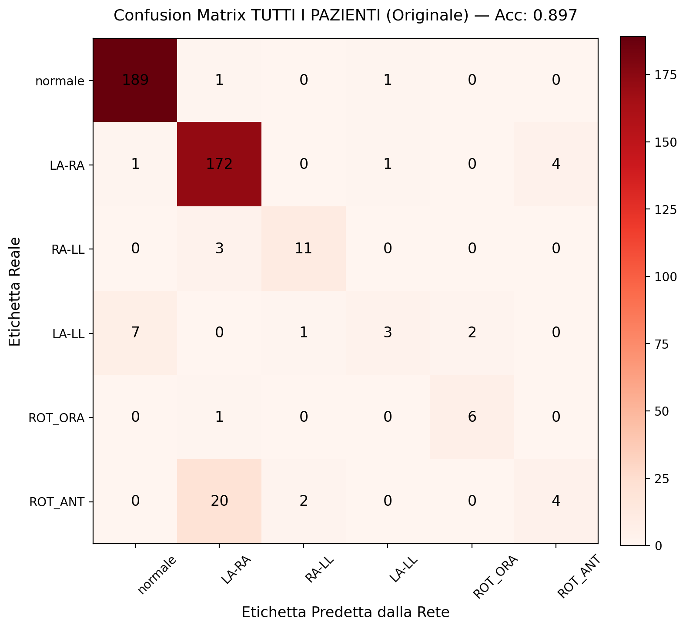
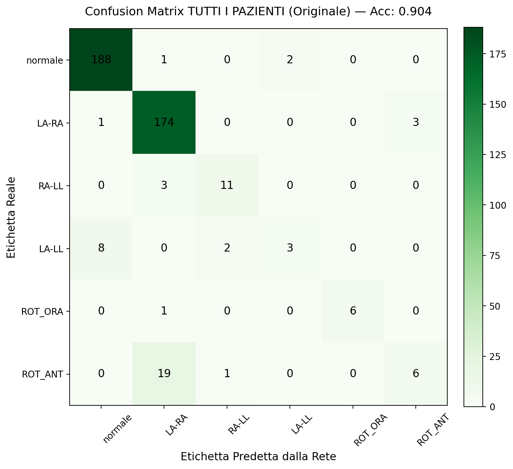
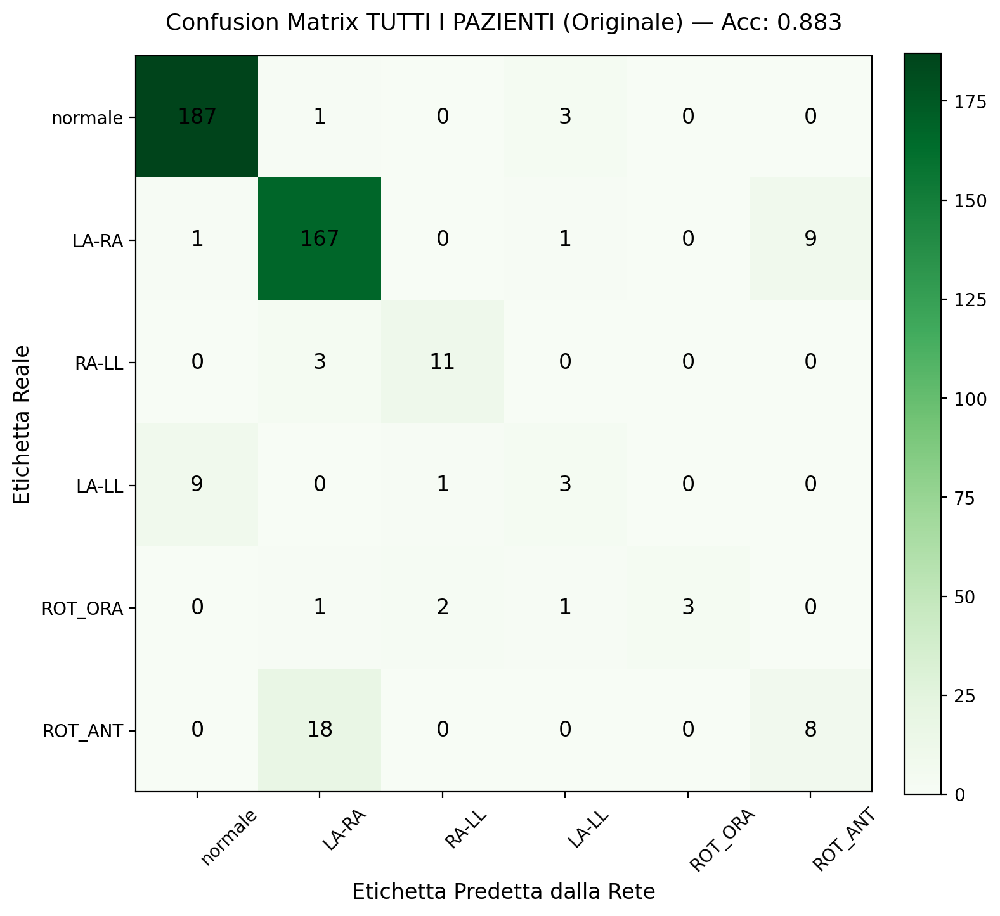

# Analisi dei Risultati e Comparazione delle Configurazioni

## 1. Composizione e Razionale del Dataset di Training

Per addestrare modelli in grado di generalizzare efficacemente in scenari reali ("in-the-wild"), è stato necessario superare la sfida dei falsi positivi indotti da alterazioni morfologiche fisiologiche o patologiche del tracciato. A questo scopo, è stato costruito un dataset di addestramento specifico, estraendo 20.000 referti verificati dal database ospedaliero (`records_complete.db`). 

Per garantire la pulizia del dato, sono stati scartati a priori tutti i referti contenenti keyword relative a malposizionamenti espliciti (es. "scambio", "errato", "periferic"), artefatti tecnici o presenza di pacemaker.
Il dataset risultante è stato bilanciato per includere un numero uguale di campioni per categorie cliniche strategiche:
- **5.000 ECG Sani** (Tracciati normali, asse compreso tra -30° e +90°)
- **5.000 ECG con Blocco di Branca Destra (RBBB)** (Variazioni dei vettori terminali del QRS verso destra)
- **5.000 ECG con Deviazioni Assiali**: suddivisi tra ~2.000 Deviazioni Assiali Destre (RAD, asse tra +90° e +180°) e ~3.000 Sinistre (LAD, asse tra -30° e -90°)
- **5.000 ECG con Patologie Miste** (Altro)

**L'importanza della distribuzione e della deviazione dell'asse:**
Questa scelta distributiva è il cuore della robustezza del modello. Le inversioni degli elettrodi periferici causano profonde alterazioni dell'asse elettrico sul piano frontale. Ad esempio, l'inversione LA-LL devia marcatamente l'asse verso sinistra (mimando una LAD tra -30° e -90°), mentre l'inversione RA-LL devia l'asse tipicamente verso destra (mimando una RAD tra +90° e +180°). Forzando l'esposizione della rete neurale a patologie che presentano deviazioni assiali fisiologiche correlate all'inversione, il modello viene addestrato a percepire le sottili differenze morfologiche tra una vera deviazione asse patologica e una deviazione indotta dal malposizionamento degli elettrodi. Questo approccio abbassa drasticamente l'incidenza di falsi positivi su pazienti cardiopatici.

---

## 2. Esperimenti e Setup delle Derivazioni

Al fine di quantificare il reale apporto informativo di ciascun elettrodo, l'architettura è stata testata incrementando progressivamente la disponibilità spaziale delle derivazioni. Tutti i test successivi riportano le metriche calcolate aggregando le finestre a livello "per paziente", confrontando le predizioni con le annotazioni cliniche reali non-gold standard.

### 2.1 Setup `limbs_extended` (III, aVR, V6)
Il primo esperimento costituisce un test di "stress" dell'architettura. In questa configurazione, le derivazioni periferiche vengono tagliate drasticamente, fornendo alla rete in ingresso solamente tre tracce: **III, aVR e V6**.
Nonostante l'apparente povertà del dato, le derivazioni III e aVR formano un sistema vettoriale indipendente e robusto sul piano frontale di Einthoven, fornendo le componenti matematiche di base da cui è possibile estrarre l'asse. A questa base matematica viene fisicamente concatenato il segnale della derivazione **V6**. Questa aggiunta fornisce alla rete un'indispensabile "ancora" spaziale: provenendo dal piano orizzontale (precordiale), V6 non è quasi mai affetta dagli scambi degli arti e rappresenta il riferimento assoluto dell'apice sinistro del cuore. Questo permette al modello di dirimere le ambiguità speculari generate dalle sole periferiche. Pur osservando un leggero calo delle performance dovuto alla perdita di risoluzione, il modello mantiene una precisione sorprendente.

### 2.2 Setup `limbs_complete` (Tutte le Periferiche + V6)
Nel secondo step è stato reintrodotto l'intero set delle 6 derivazioni periferiche classiche (I, II, III, aVR, aVL, aVF) sempre affiancate dall'ancora V6.
L'uso congiunto di tutte le derivazioni frontali annulla il fisiologico calo di performance dell'esperimento precedente. Il modello riacquista piena confidenza, "pulendo" la diagonale della matrice di confusione dai falsi positivi residui. Questo setup definisce il bilanciamento ideale ("sweet spot") tra affidabilità clinica e minimizzazione dell'input.

### 2.3 Setup `limbs_v1+v6`
Per verificare la possibilità di estrarre ulteriore margine prestazionale, all'esperimento `complete` è stata aggiunta la derivazione V1, fornendo al modello anche un'informazione diretta sull'elettrofisiologia del lato destro del cuore.
I risultati dimostrano una chiara saturazione: l'aggiunta di V1 non produce alcun miglioramento significativo. Questo certifica definitivamente che la derivazione V6, per via della sua stabilità morfologica, è da sola un riferimento sufficiente e ottimale per la classificazione.

---

## 3. Confronto Visivo: Matrici di Confusione Per Paziente

Di seguito si riportano le tre matrici di confusione calcolate sui pazienti reali (Non-Gold) per le tre configurazioni testate.

*Figura 1: Modello `limbs_extended`. Nonostante le sole 3 derivazioni fornite, la base vettoriale permette ottimi risultati, seppur con un lieve accumulo di errori fisiologici e confusione tra famiglie.*

*Figura 2: Modello `limbs_complete`. Il ritorno al set completo assicura il recupero prestazionale pieno, migliorando la precisione sulla diagonale principale.*

*Figura 3: Modello `limbs_v1+v6`. La saturazione delle performance è evidente: la matrice è pressoché identica alla precedente, a riprova che V1 non aggiunge un guadagno informativo utile ai fini di questo task.*

---

## 4. Analisi degli Errori e Confusione tra "Famiglie"

Analizzando le matrici di confusione (in particolar modo per il modello `extended` e in misura minore per i successivi), si nota che la rete neurale non sbaglia in modo casuale, ma tende a confondere sistematicamente inversioni appartenenti a specifiche "famiglie" elettrofisiologiche o posizionali che condividono forti somiglianze morfologiche:

1. **Confusione tra `Normale` e `LA-LL`**: L'inversione Braccio Sinistro - Gamba Sinistra (LA-LL) è l'errore tecnicamente più insidioso. Molto spesso, il segnale LA-LL produce modifiche al tracciato estremamente lievi che rientrano nelle varianti della normalità. È quindi l'inversione maggiormente predetta come "Normale".
2. **Confusione tra `LA-RA` e `ROT_ANT` (Rotazione Antioraria)**: L'inversione tra le due braccia (LA-RA) condivide una profonda affinità con l'inversione fisica degli elettrodi precordiali (in questo caso, la simulazione o l'effetto di una rotazione antioraria). Entrambe queste condizioni invertono la direzionalità laterale dei vettori, portando la rete a confonderle frequentemente.
3. **Confusione tra `ROT_ORA` (Rotazione Oraria) e `RA-LL`**: Si osserva una spiccata tendenza della rete a scambiare la Rotazione Oraria con lo scambio Braccio Destro - Gamba Sinistra (RA-LL). Anche in questo caso, le complesse ripercussioni della RA-LL sull'asse (spostato verso l'alto e a destra) possono presentare tratti morfologici simili allo slittamento dei vettori generato da una rotazione oraria del cuore o degli elettrodi precordiali.
